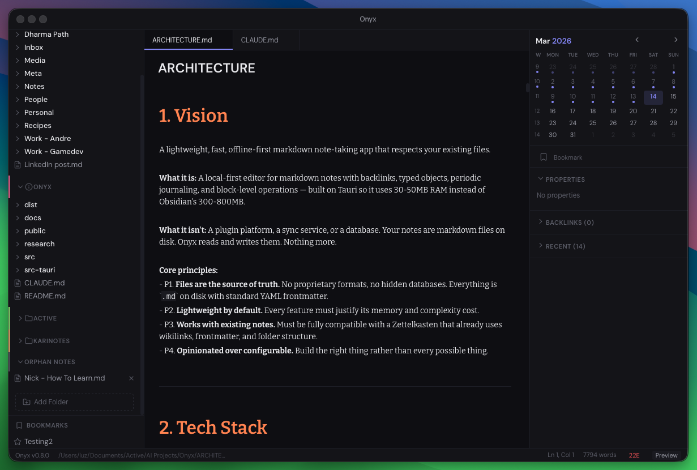

# Onyx

A lightweight, offline-first markdown note-taking app. Built with Tauri 2, React 18, CodeMirror 6, and SQLite.

Onyx is designed as a fast, native alternative to Electron-based note apps. It uses ~30-50MB of RAM compared to 300-800MB for comparable tools.



## Notes from the developer

This is a fun project.

This is a proof of concept. 

This is to showcase llm capabilities with 4 days of part time work. 

This isn't meant to be used by you. 

This will not be maintained.  

This is a canvas for you to start playing around. 

## Features

- **Editor** — CodeMirror 6 with live preview, inline formatting, and source mode toggle
- **Wikilinks & backlinks** — `[[link]]` syntax with full backlink tracking
- **YAML frontmatter** — Typed objects with a property panel UI
- **Periodic notes** — Daily, weekly, and monthly notes with templates
- **Tabs & navigation** — Per-tab back/forward history, drag-to-reorder tabs
- **Quick open** — Fuzzy file search with `Cmd+O`
- **Command palette** — `Cmd+P` for all commands
- **Calendar widget** — Navigate periodic notes from the context panel
- **Bookmarks** — Pin notes to the sidebar for quick access
- **Theming** — Dark, light, and warm themes. Per-element color overrides for headings, links, tags, code, blockquotes. Configurable heading sizes, editor font, UI font, and syntax highlighting colors
- **Linting** — 10 autofix rules + 4 warnings, autofix on save. Configurable per-rule
- **Multiple directories** — Register any number of directories with color-coded accents for visual distinction. No vault lock-in
- **Tables** — GFM table editing with keyboard navigation
- **Outliner** — List indent/outdent/move operations
- **Auto-save** — 500ms debounce, no save dialogs
- **Offline-first** — Everything stored locally as plain markdown files

## Download

Get the latest release from the [Releases](https://github.com/hikarinessa/onyx/releases) page.

macOS (Apple Silicon) is the primary build target. Windows and Linux support is planned.

## Building from Source

### Prerequisites

- [Rust](https://rustup.rs/) (1.77.2+)
- [Node.js](https://nodejs.org/) (18+)
- [Tauri CLI](https://v2.tauri.app/start/prerequisites/)

### Development

```bash
npm install
cargo tauri dev
```

### Production Build

```bash
cargo tauri build
```

### Type Checking

```bash
cargo check          # Rust
npx tsc --noEmit     # TypeScript
```

## Project Structure

```
src/                  # Frontend (React + TypeScript)
  components/         #   UI components (editor, sidebar, panels, etc.)
  extensions/         #   CodeMirror 6 extensions (live preview, wikilinks, etc.)
  lib/                #   Utilities (file ops, keybindings, config, etc.)
  stores/             #   Zustand state management
  styles/             #   CSS (reset, theme, layout)
src-tauri/            # Backend (Rust)
  src/                #   Tauri commands, SQLite, file watcher, indexer
docs/                 # Design docs, dev plan, architecture spec
```

See `docs/ARCHITECTURE.md` for the full design spec.

## Tech Stack

### Frontend
| | |
|---|---|
| UI | React 18 + TypeScript |
| Editor | CodeMirror 6 + Lezer markdown |
| State | Zustand 5 |
| Styling | Plain CSS with custom properties (no Tailwind) |
| Build | Vite |

### Backend
| | |
|---|---|
| Runtime | Tauri 2 (Rust) |
| Database | SQLite (rusqlite, WAL mode) |
| Markdown | pulldown-cmark (with native wikilink support) |
| Templates | minijinja |
| File watching | notify |
| Fuzzy search | nucleo-matcher (from Helix editor) |

## Acknowledgements

Onyx builds on the work of many open-source projects. Key influences:

- [Zettlr](https://github.com/Zettlr/Zettlr) — CM6 editor architecture patterns
- [Otterly](https://github.com/ajkdrag/otterly) — Rust backend design (atomic writes, conflict detection, indexing)
- [lezer-markdown-obsidian](https://github.com/erykwalder/lezer-markdown-obsidian) — Wikilink and tag parser extensions
- [codemirror-rich-markdoc](https://github.com/segphault/codemirror-rich-markdoc) — Live preview decoration patterns
- [Obsidian](https://obsidian.md/) — Feature inspiration and the Zettelkasten workflow that motivated this project

Built with [Tauri](https://tauri.app/), [CodeMirror](https://codemirror.net/), [React](https://react.dev/), and [SQLite](https://sqlite.org/).

## License

[MIT](LICENSE)
